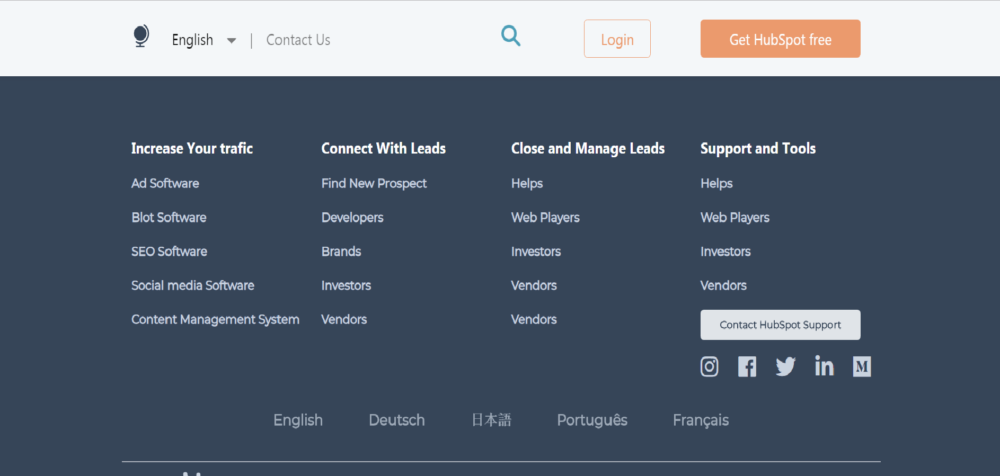
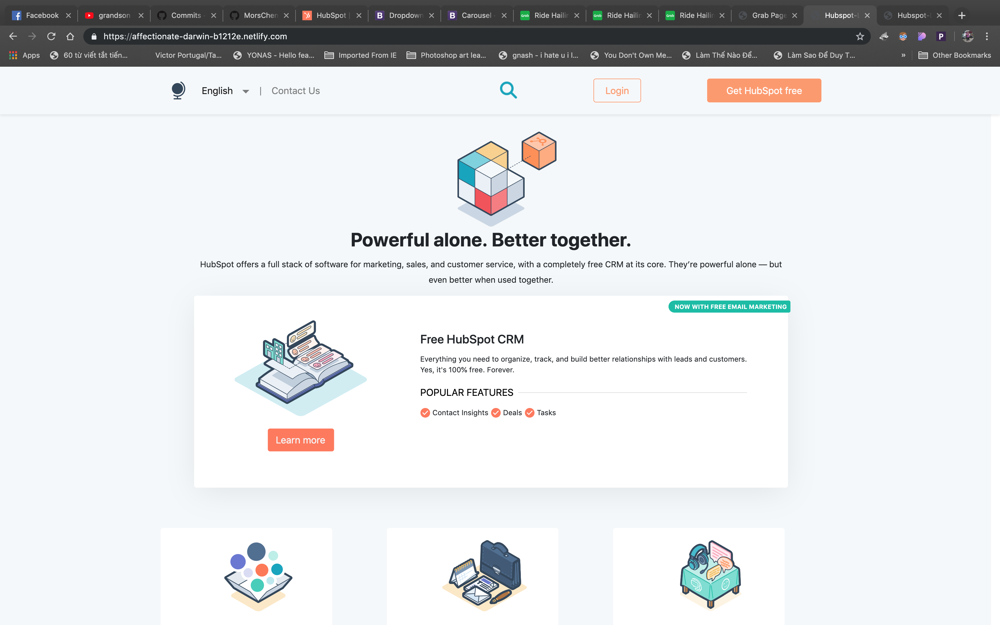

# Hubspot Landing Page
https://affectionate-darwin-b1212e.netlify.com/

## Section 2

## Section Commitments:

### &nbsp;Section 1:

&nbsp;&nbsp;&nbsp; NavBar1+Footer+Learn&Grow

&nbsp;&nbsp;&nbsp; NavBar1 - Dropdown link - Button: Hover change color/opacity - Sticky

&nbsp;&nbsp;&nbsp; Footer - Text/button: hover change color/shadow - Dropdown

&nbsp;&nbsp;&nbsp; Learn&Grow - Text - Image

&nbsp;&nbsp;&nbsp;&nbsp; The sticky navbar and footer was built using bootstrap providing repsonsiveness to the two elements

### &nbsp; Section 2: NavBar2 + Jumbotron

&nbsp; &nbsp; &nbsp; NavBar2 - Dropdown link

&nbsp; &nbsp; &nbsp; Jumbotron - Text image - Button: hover change of color/opacity

## Section 2 

In this section,I provided it in 2 parts - navbar and flexbox. 
I am buiding the navbar by using boostraps. In addition, I also add dropdown button with mega menu.

In the second part, I am using flexbox. This kinda like our spotify landing home page. 

---

### &nbsp; Section 3: App Features

&nbsp; &nbsp; &nbsp; Jumbotron: - Text - Image

&nbsp; &nbsp; &nbsp; 1 Big Card - Button: hover change color/opacity - Card: hover change size

&nbsp; &nbsp; &nbsp; 3 Small Cards - Button: hover change color/opacity - Card: hover change size - 3 columns

!
! Hi Guys, I, Hang Tran.
###This is section 3 of Hubspot landing page.
! First, I analyze the content in my section.
! Thhen I search style I need in Bootstrap.
!
! My Section has 3 containers: S3-Container1 2 and 3.
! i use Style Cards in Bootstrap in all Containers and Picture, we can find by CSS-Peeper.
!

---

### &nbsp; Section 4: Learn & Grow, Customers & Call to action

&nbsp; &nbsp; &nbsp; Customer - Text - Image - 2 columns

&nbsp; &nbsp; &nbsp; Call to action - Button: hover change color/opacity
2 columns

Hi all, my name is Thien and I created 3 parts of the Hubspot Landing Page.

Part Learn & Grow: 
- 1 big Jumbotron with gradient background
- grid style images and texts

Part Customer:
- 1 row divided into 2 unequal width columns. 
- One column with texts, One column with a grid style of 8 customers' logos.

Part Call to action:
- 1 row divided into 2 unequal width columns. 
- One column with texts & a button with hover color change. One column with an image.

https://affectionate-darwin-b1212e.netlify.com/

